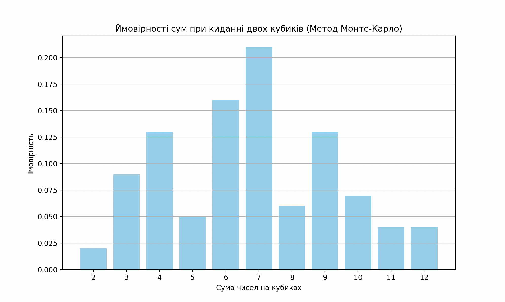
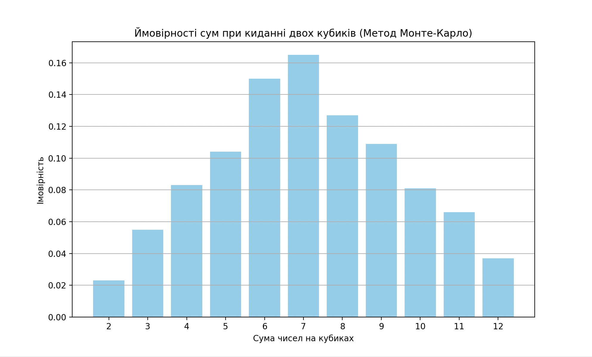
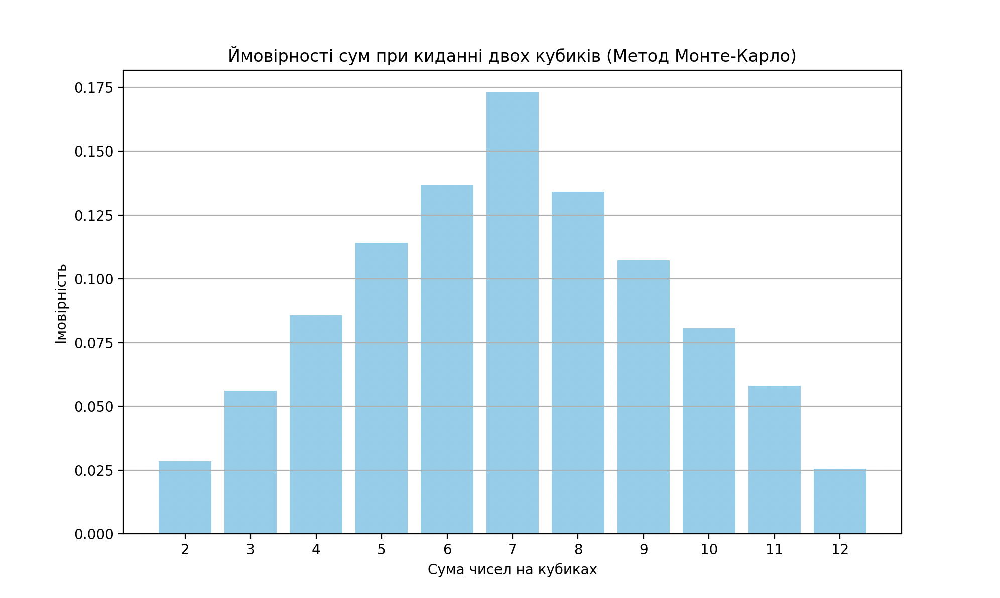

## Використання методу Монте-Карло для симуляції кидків кубиків

### Аналітичні значення ймовірностей для кожної суми при киданні двох кубиків:

| Сума | Імовірність  |
|------|--------------|
| 2    | 2.78% (1/36) |
| 3    | 5.56% (2/36) |
| 4    | 8.33% (3/36) |
| 5    | 11.11% (4/36)|
| 6    | 13.89% (5/36)|
| 7    | 16.67% (6/36)|
| 8    | 13.89% (5/36)|
| 9    | 11.11% (4/36)|
| 10   | 8.33% (3/36) |
| 11   | 5.56% (2/36) |
| 12   | 2.78% (1/36) |

### Результати симуляції при різних кількостях кидків:

#### Результати при киданні 100 разів:

| Сума | Ймовірність |
|------|-------------|
| 2    | 0.0200      |
| 3    | 0.0900      |
| 4    | 0.1300      |
| 5    | 0.0500      |
| 6    | 0.1600      |
| 7    | 0.2100      |
| 8    | 0.0600      |
| 9    | 0.1300      |
| 10   | 0.0700      |
| 11   | 0.0400      |
| 12   | 0.0400      |

#### Результати при киданні 1000 разів:

| Сума | Ймовірність |
|------|-------------|
| 2    | 0.0230      |
| 3    | 0.0550      |
| 4    | 0.0830      |
| 5    | 0.1040      |
| 6    | 0.1500      |
| 7    | 0.1650      |
| 8    | 0.1270      |
| 9    | 0.1090      |
| 10   | 0.0810      |
| 11   | 0.0660      |
| 12   | 0.0370      |

#### Результати при киданні 10000 разів:

| Сума | Ймовірність |
|------|-------------|
| 2    | 0.0285      |
| 3    | 0.0560      |
| 4    | 0.0858      |
| 5    | 0.1140      |
| 6    | 0.1370      |
| 7    | 0.1731      |
| 8    | 0.1341      |
| 9    | 0.1072      |
| 10   | 0.0807      |
| 11   | 0.0580      |
| 12   | 0.0256      |

### Порівняння та висновки:

1. **При киданні кубиків 100 разів:**
   - Результати дещо відрізняються від аналітичних значень через малу кількість симуляцій. Ймовірності не стабільні, і розкид значень великий.

2. **При киданні кубиків 1000 разів:**
   - Результати ближчі до аналітичних значень, але все ще спостерігаються деякі відхилення. Загальна тенденція розподілу ймовірностей вже помітна.

3. **При киданні кубиків 10000 разів:**
   - Результати дуже близькі до аналітичних значень. Відхилення мінімальні, і розподіл ймовірностей стабілізується.

Чим більше ми збільшуємо кількість симуляцій, тим більше результати наближаються до теоретичних значень. Це демонструє силу методу Монте-Карло: з великою кількістю симуляцій ми можемо наблизитися до аналітичних розрахунків, підтверджуючи їхню точність.

### Висновок:
Метод Монте-Карло є потужним інструментом для наближеного обчислення ймовірностей та інших величин. Зі збільшенням кількості симуляцій точність результатів підвищується, що дозволяє отримати розподіл значень, близький до аналітичного.
